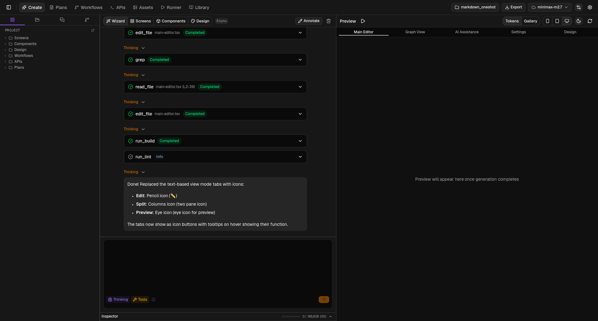
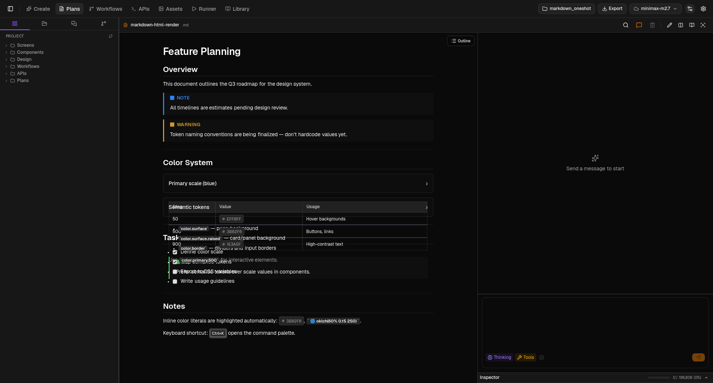
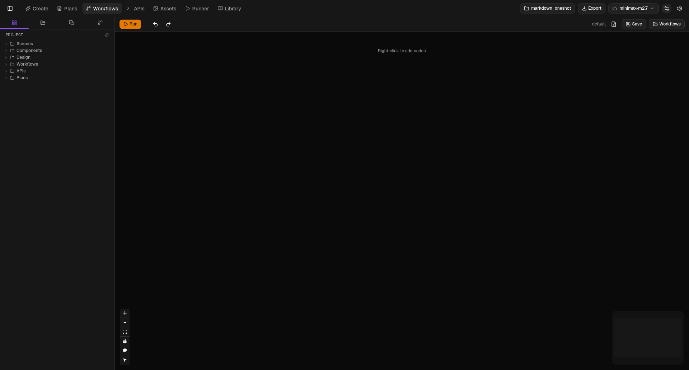
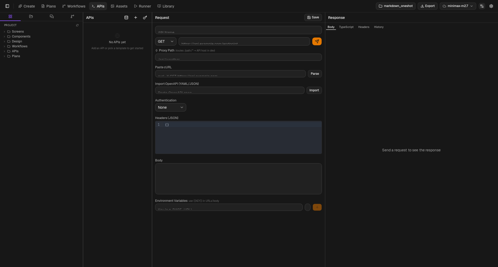
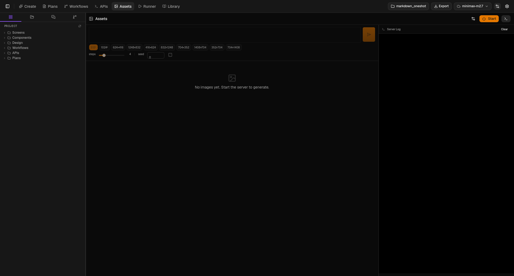
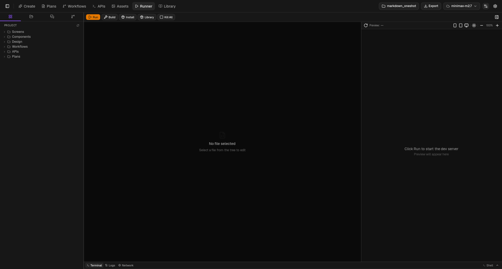
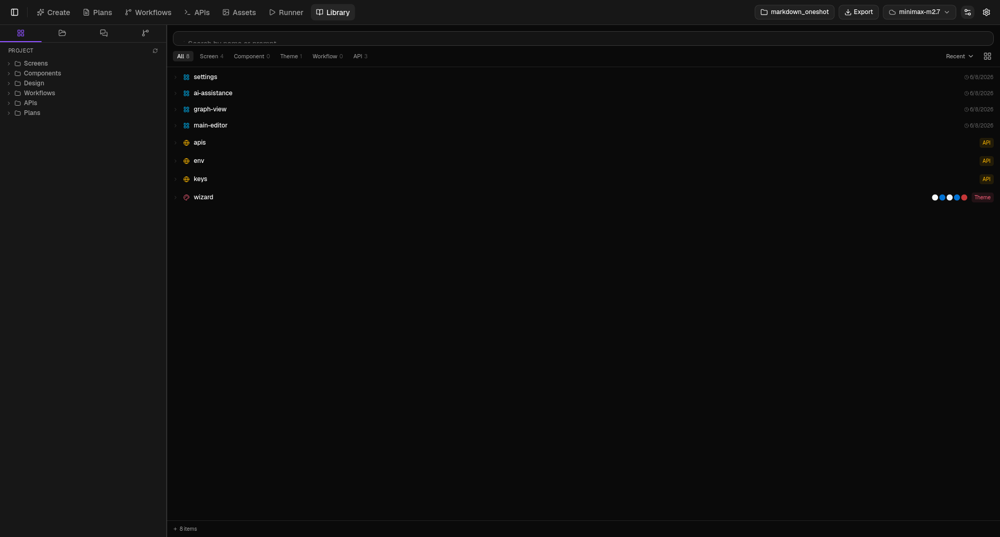

# Prototyper

AI-powered UI prototyping desktop app. Built with Tauri v2 (Rust backend) + React 19 + TypeScript frontend. Connects to local Ollama, Ollama Cloud, OpenAI, and Claude for code generation, and spawns real `bun dev` processes for live preview.

## Tech Stack

| Layer | Technology | Version |
|-------|-----------|---------|
| Shell | Tauri v2 | `2` |
| Frontend | React | `^19.1.0` |
| Language | TypeScript | `~5.8.3` |
| Build | Vite | `^7.0.4` |
| Styling | Tailwind CSS | `^4.2.4` |
| UI Kit | shadcn/ui (radix-ui) | `radix-ui ^1.4.3` |
| Layout | allotment | `^1.20.5` |
| Editor | CodeMirror 6 (`@uiw/react-codemirror`) | `^4.25.9` |
| Icons | lucide-react | `^1.11.0` |
| State | Zustand | `^5.0.12` |
| Data fetching | TanStack React Query | `^5.100.1` |
| Graph | React Flow (`@xyflow/react`) | `^12.10.2` |
| Terminal | xterm.js (`@xterm/xterm`) | `^6.0.0` |
| Runtime | Bun | any recent |
| Backend | Rust (edition 2021) | — |
| AI | Ollama (`ollama-rs`) + OpenAI + Claude via `reqwest` | `0.3` |
| Forms | react-hook-form + zod + `@hookform/resolvers` | — |
| Validation | zod | — |
| Markdown | react-markdown + remark-gfm + remark-breaks + remark-github-alerts + rehype-raw + marked | — |
| Charts | recharts | — |
| Tree | `@headless-tree/react` | — |
| Command palette | cmdk | — |
| Drawer | vaul | — |
| Toasts | sonner | — |
| Syntax highlight | shiki | — |
| Auto-scroll chat | `use-stick-to-bottom` | — |
| OTP / Date / Carousel | `input-otp`, `react-day-picker`, `embla-carousel-react` | — |
| Token count | `js-tiktoken` | — |
| YAML | `js-yaml` | — |
| Unit tests | vitest + jsdom | — |
| E2E tests | WebdriverIO + Playwright + axe-core | — |
| Tauri driver | `@crabnebula/tauri-driver` | — |

<details>
<summary>Key Tauri plugins (Rust)</summary>

- `tauri-plugin-shell` — process spawning
- `tauri-plugin-fs` — file system (with `watch` feature)
- `tauri-plugin-http` — HTTP client
- `tauri-plugin-store` — persistent key-value store
- `tauri-plugin-clipboard` — clipboard access
- `tauri-plugin-dialog` — native file/message dialogs
- `tauri-plugin-mcp-bridge` — MCP bridge (debug builds only)
</details>

## Prerequisites

- [Bun](https://bun.sh/) — package manager and JS runtime
- [Rust](https://rustup.rs/) — `rustc` + `cargo`
- Linux deps: `libwebkit2gtk-4.1-dev`, `libappindicator3-dev`, etc. (see [Tauri prerequisites](https://v2.tauri.app/start/prerequisites/))
- Optional: [Ollama](https://ollama.com) running locally for AI features (default `http://localhost:11434`)
- Optional: OpenAI or Anthropic API keys for cloud AI providers

## Install & Run

```bash
bun install              # install all dependencies
bun run tauri:dev        # start dev server
```

## Production Build

```bash
bun run tauri:build      # outputs to src-tauri/target/release/bundle/
```

Platform outputs: `.deb` + `.AppImage` (Linux), `.dmg` + `.app` (macOS), `.msi` + `.exe` (Windows).

## Project Structure

```
src/
  App.tsx                  # App shell — allotment layout, view routing, dark/accent theming
  main.tsx                 # React entry point
  layout/
    Header.tsx             # 7 view tabs (Create, Plans, Workflows, APIs, Assets, Runner, Library), model picker, project selector, settings
    SidebarRail.tsx        # File explorer sidebar with CRUD for screens/components/etc.
  panels/
    create/                  # "Create" view — segmented control switches between 4 sub-modes
      CreatePanel.tsx
      modes/
        WizardMode.tsx       # Full-app generator: ask_user Q&A, live preview, visual annotations
        ScreensMode.tsx      # Chat + AI generation + device preview (embeds FlowsView)
        ComponentsMode.tsx   # Prompt → component code + live preview
        ThemesMode.tsx       # Prompt → CSS theme generation
        screens/             # Sub-components for ScreensMode
      wizard/                # Sub-components for WizardMode
        WizardChatPanel.tsx
        WizardPreviewPane.tsx
        WizardAnnotations.tsx
    plans/                   # Plans panel sub-components
    apis/                    # APIsPanel
    runner/                  # RunnerPanel + RunnerTerminal, RunnerEditor, RunnerPreview
    assets/                  # AssetsPanel + AssetGrid, AssetPreviewLightbox, BonsaiConfigPopover
    library/                 # LibraryPanel sub-components
    theme-preview/           # ThemeTokenPreview + token preview widgets
  workflows/
    WorkflowsView.tsx      # Visual node-based execution canvas
    useWorkflowExecution.ts
    useWorkflowPersistence.ts
    WorkflowActionsContext.ts
    NodePropertiesPanel.tsx
    NodeFieldSections.tsx
    nodeTypes.tsx
    Lasso.tsx / lassoUtils.ts
    OutputChatPanel.tsx
    templates.ts
  modals/
    SettingsModal.tsx          # General, AI, Styles, Prompts settings
    ProjectManagerModal.tsx    # Create / switch / delete projects
    ExportModal.tsx             # Export project to zip
    AddLibraryModal.tsx         # Add library dependencies
    PromptConfigModal.tsx       # Configure prompt templates
    ComponentExportModal.tsx    # Export single component
    SaveComponentModal.tsx      # Save generated component
  components/
    chat/                   # ChatInput, MessageList, MentionPicker, etc.
    ui/                     # ~50 shadcn primitives + 20 domain components (70 total, incl. AnnotationOverlay)
    CodeMirrorEditor.tsx    # CM6 editor wrapper
    PromptInspector.tsx     # Assembled prompt / JSON / cURL viewer
    ModelPicker.tsx         # Provider + model selector
    ModelOptionsPopover.tsx # Model parameter controls
    ProjectExplorer.tsx     # Tree navigation component
    AttachComposer.tsx
    XTerminal.tsx            # xterm.js terminal wrapper
    ErrorBoundary.tsx
    PreviewErrorBoundary.tsx
  hooks/
    useSettings.ts              # Tauri Store persistence (thin re-export)
    useChat.ts                   # Chat session management + streaming (used by all panel-level UIs including the Wizard)
    useProjectFiles.ts          # Project file operations + query keys
    useModelCapabilities.ts     # Model capability detection
    useAllotmentLayout.ts       # Pane size persistence
    useToast.ts                  # Toast notification hook
    useBonsai.ts                 # Bonsai server + asset gallery lifecycle
    useScreenCode.ts             # Screen code save/load
    useHotspotTracking.ts        # Hotspot tracking
    useGitStatus.ts              # Git status queries
    useGitMutations.ts           # Git mutation commands
    use-mobile.ts                # Mobile breakpoint detection
    chat/                        # Streaming helpers (compactSummary, contextWindow, dedupeMentions, etc.)
  stores/
    appStore.ts                  # Global app settings (Zustand)
    chatStore.ts                 # Chat state (Zustand)
    projectSettingsStore.ts      # Per-project settings (Zustand)
    bonsaiStore.ts               # Bonsai server state + asset gallery (Zustand)
    uiStore.ts                   # UI state (Zustand)
  lib/
    ipc.ts                  # All invoke() wrappers — single source of truth for Rust↔TS calls
    notifications.ts        # Safe IPC wrappers with toast notifications
    navigation.ts           # Screen navigation helpers
    queryClient.ts          # React Query client
    queryKeys.ts            # Query key factory
    stream-channel.ts       # Tauri Channel → AsyncIterable bridge for streaming
    bonsai.ts                # Bonsai types + helpers
    models.ts                # Model utilities (capability detection helpers)
    context-menu.ts          # Context menu helpers
    scaffold.ts              # Scaffolding core (213 lines)
    scaffold-shadcn.ts       # shadcn scaffold logic (800 lines)
    scaffold-notifications.ts # Scaffold toast helpers
    prompts.ts               # Prompt registry
    prompts/
      screens.ts             # Screen-generation prompt templates
      components.ts          # Component prompt templates
      themes.ts              # Theme prompt templates
      workflows.ts           # Workflow prompt templates
      wizard.ts              # Full-app-generation prompt templates (uses ask_user)
      shared.ts              # Shared prompt utilities
    preview.tsx              # Preview rendering (Babel JSX transform)
    utils.ts                 # cn() class-merger helper
    item-meta.ts             # Item metadata helpers
    dev-server-manager.ts    # Dev server lifecycle (port, kill, restart)
    design/
      spec.ts                # DesignLanguageSpec zod schema
      persist.ts             # Design spec persistence
  types/
    chat.ts                 # Shared chat types
  styles/
    globals.css             # Tailwind v4 @theme inline block + CSS custom properties
src-tauri/
  src/
    lib.rs                   # App setup, plugins, generate_handler![] (48 commands)
    main.rs                  # Thin passthrough to lib.rs
    commands/
      process.rs             # Bun/shell spawning, kill
      fs.rs                  # File system CRUD + symlink + reveal
      http.rs                # HTTP client
      ai.rs                  # Streaming completion, tool permissions
      ai_providers.rs        # OpenAI/Claude provider implementations
      ai_ollama.rs           # Ollama-specific logic + model listing + presets
      export.rs              # Project/component export
      workflows.rs           # Workflow persistence
      mod.rs
    agent/                   # AI agent module (loop, executor, tools)
    sandbox/                 # Linux sandbox (landlock + seccomp + bwrap)
    bin/ + scripts/          # Test binaries: test_agent (Rust harness), test_cursor_chat (TUI smoke test)
  capabilities/default.json  # Tauri plugin permissions
  tauri.conf.json            # Window config (1400×900), CSP, devUrl (port 1420)
  Cargo.toml                 # Rust dependencies
```

## Views (7 Tabs)

| View | ID | Panel Component | Description |
|------|----|-----------------|-------------|
| Create | `create` | `CreatePanel` | Segmented control switching between Wizard, Screens, Components, Themes sub-modes |
| Plans | `plans` | `PlansPanel` | Markdown plan/spec editor with chat-assisted authoring |
| Workflows | `workflows` | `WorkflowsView` | Node-based execution canvas (React Flow) |
| APIs | `apis` | `APIsPanel` | HTTP request/response testing |
| Assets | `assets` | `AssetsPanel` | AI image generation (Bonsai), asset gallery |
| Runner | `runner` | `RunnerPanel` | File tree, terminal (xterm.js), live preview |
| Library | `library` | `LibraryPanel` | Searchable library of components, themes, screens, workflows, APIs |

## Screenshots

| Create | Plans |
|--------|-------|
|  |  |

| Workflows | APIs |
|-----------|------|
|  |  |

| Assets | Runner |
|--------|--------|
|  |  |

| Library | |
|---------|---|
|  | |

### Workflow Node System

The Workflows view uses a 7-category node type system (defined in `nodeTypes.tsx`),
each with its own hue on the node's accent bar:

| Category | Token | Typical use |
|----------|-------|-------------|
| IO | `--node-io` (emerald 162°) | File read/write, HTTP fetch |
| Analysis | `--node-analysis` (gold 70°) | Inspect, summarize |
| Planning | `--node-planning` (violet 304°) | Decompose, plan |
| Generation | `--node-generation` (blue 264°) | Code, content, image |
| Composition | `--node-composition` (emerald 162°) | Stitch outputs together |
| Utility | `--node-utility` (rose 16°) | Glue, transforms |
| Custom | `--node-custom` (neutral) | User-defined |

Run state is communicated separately via `--status-running` (blue), `--status-done`
(emerald), `--status-error` (red), `--status-paused` (gold) on the node border. See
[DESIGN.md](DESIGN.md) for the full token system.

## Rust Commands (48 total)

All commands must be registered in `generate_handler![]` in `lib.rs`. Plugin permissions (e.g., `shell:default`, `fs:default`) must be declared in `capabilities/default.json` — missing either causes silent failure.

| Group | Commands |
|-------|----------|
| Process (10) | `bun_dev`, `bun_build`, `bun_install`, `bun_install_sync`, `run_shell_command`, `run_shell_command_sync`, `run_shell_command_capture`, `kill_process`, `kill_all_processes`, `kill_port` |
| File System (9) | `read_dir`, `read_file`, `write_file`, `create_dir`, `delete_file`, `delete_dir`, `rename_file`, `create_symlink`, `reveal_in_explorer` |
| HTTP (3) | `http_request`, `test_searxng_connection`, `setup_searxng_config` |
| AI (10) | `generate_completion`, `generate_completion_stream`, `stop_generation_stream`, `resolve_tool_permission`, `resolve_ask_user`, `resolve_ask_user_form`, `list_anthropic_models`, `list_ollama_models`, `save_model_presets`, `load_model_presets` |
| Bonsai (11) | `bonsai_start_server`, `bonsai_stop_server`, `bonsai_server_status`, `bonsai_generate_image`, `bonsai_cancel_generation`, `bonsai_list_assets`, `bonsai_delete_asset`, `bonsai_get_server_config`, `bonsai_save_server_config`, `bonsai_schedule_stop`, `bonsai_cancel_stop` |
| Export (2) | `export_project`, `export_component` |
| Workflows (3) | `save_workflow`, `load_workflow`, `list_workflows` |

All commands registered in `generate_handler![]` in `lib.rs`. Plugin permissions (e.g., `shell:default`, `fs:default`) must be declared in `capabilities/default.json` — missing either causes silent failure.

## AI Providers

The app supports **4 AI providers** with a unified streaming interface:

| Provider | Host | Auth |
|----------|------|------|
| Ollama (local) | Configurable (default: `http://localhost:11434`) | None |
| Ollama Cloud | `https://ollama.com` | API key |
| OpenAI | `https://api.openai.com` | API key |
| Claude | `https://api.anthropic.com` | API key |

Streaming uses Tauri Channel IPC (not events):

```typescript
import { Channel } from '@tauri-apps/api/core';
const channel = new Channel<CompletionEvent>();
channel.onmessage = (msg) => {
  if (msg.event === 'Chunk')    append(msg.data.text);
  if (msg.event === 'ToolCall') handleToolCall(msg.data);
  if (msg.event === 'ToolPermission') requestApproval(msg.data);
  if (msg.event === 'ToolResult')     showToolResult(msg.data);
  if (msg.event === 'AskUser')        promptUser(msg.data);     // any panel: text | choice | confirm
  if (msg.event === 'AskUserForm')   promptForm(msg.data);     // any panel: multi-field form
  if (msg.event === 'Done')     setLoading(false);
  if (msg.event === 'Error')    setError(msg.data.message);
};
await generateCompletionStream(model, messages, host, apiKey, onEvent: channel, ...);
```

`CompletionEvent` mirrors the Rust enum and includes 9 variants: `Chunk`, `ToolCall`, `ToolPermission`, `ToolResult`, `AskUser`, `AskUserForm`, `TodoUpdate`, `Done`, `Error`. Both `AskUser` and `AskUserForm` are section-agnostic — any panel can register `onAskUser`/`onAskUserForm` callbacks in `useChat`; if no handler is registered the backend is immediately unblocked. The frontend must call `resolveAskUser()` / `resolveAskUserForm()` within 180s.

## Data Persistence

| Data | Mechanism | Location |
|------|-----------|----------|
| App settings | `tauri-plugin-store` | `settings.json` in app data dir |
| Project files | File system IPC (`read_file`/`write_file`) | `projects/{projectId}/` under app data |
| Assets | File system + sidecar JSON | `projects/{projectId}/assets/` |
| Bonsai config | `tauri-plugin-store` | `bonsai_config.json` in app data dir |
| Workflows | `save_workflow`/`load_workflow` Rust commands | Per-project workflow directory |
| Model presets | `save_model_presets`/`load_model_presets` | App data dir |
| Pane sizes | `useAllotmentLayout` hook | Tauri Store |

> No `localStorage` except one-time migration of legacy keys on first launch.

## Styling

- **Tailwind CSS v4** with `@tailwindcss/vite` plugin and `@theme inline` block in `globals.css`
- **shadcn/ui** components in `src/components/ui/` — 74 total files (shadcn primitives + domain components), including `code-block`, `chat-container`, `message`, `file-upload`, `tool`, `ToolPermissionCard`
- **Custom CSS properties** for theming: `--primary`, `--ring`, `--sidebar-primary` (toggled from `appStore`)
- **Dark mode**: class-based (`document.documentElement.classList.toggle("dark", ...)`)
- **Accent color**: dynamically set via CSS custom properties from settings
- **Glow/AMOLED modes**: `glow-subtle`, `glow-full`, `amoled` class toggles

## Keyboard Shortcuts

| Shortcut | Action | Component |
|----------|-------|-----------|
| `Ctrl+S` | Save file | ComponentsPanel, RunnerPanel |
| `Ctrl+Z` | Undo | WorkflowsView |
| `Ctrl+Shift+Z` | Redo | WorkflowsView |

Shortcuts use `window.addEventListener('keydown', ...)` in `useEffect`.

## Wizard Panel

The Wizard (`WizardMode`, a sub-mode of the `"create"` view) is a full-app generator that
walks the model through collaborative design. It is the only panel that
uses the `ask_user` tool — the model can pause mid-generation and ask the
user a `text`, `choice`, or `confirm` question, then resume based on the
answer (180s timeout per question, see `agent_loop.rs`).

The Wizard is implemented as a thin panel-level wrapper over `useChat` —
no dedicated hook. It uses the same chat infrastructure as the other
panels, augmented with four optional `useChat` callbacks:

- `onAskUser`: receives `AskUser` events; renders `AskUserCard` (text/choice/confirm). Resolves via `resolveAskUser()`.
- `onAskUserForm`: receives `AskUserForm` events; renders `AskUserFormCard` (multi-field form). Resolves via `resolveAskUserForm()`.
- `onToolCall`: fires before each `ToolCall` store update; captures `set_active_theme` slugs and `register_screen` paths in-memory.
- `onToolResult`: fires after each `ToolResult` store update; applies the active theme and detects `router.tsx` writes to trigger preview navigation.

Key features:
- **Live preview** with cross-origin iframe (uses `react-frame-component` + `postMessage({type:"reload"})` for HMR).
- **Visual annotations**: click points or drag regions on the preview to send spatial feedback to the model. The overlay is the shared `AnnotationOverlay` component at `src/components/ui/AnnotationOverlay.tsx` (wired on both the iframe view and the Design tab). `WizardAnnotations.tsx` is the annotation list (pending/sent rows with remove/resolve + "Send to AI") — not the visual overlay itself.
- **Consistent preview toolbar**: the toolbar (device picker + dark mode + refresh + annotate) is identical across all four tabs; the Design tab adds a floating `Tokens | Gallery` segmented control overlaid in the top-right of the preview area (`absolute top-2 right-2 z-10 h-7 bg-background/80 backdrop-blur shadow-sm`), matching the Outline toggle treatment in `src/panels/plans/PlanPreview.tsx`.
- **Theme/screen sync**: when the model calls `set_active_theme` the active theme preset updates immediately; when it calls `register_screen` then writes `router.tsx`, the preview auto-navigates to the new screen (1500ms delay).
- **Dev server bootstrap**: on first output, the wizard auto-starts the runner dev server if a scaffold exists.

The streaming code for the AskUser handler is shown in `CLAUDE.md`'s AI
streaming section.

## Test Architecture

Three test layers live under `src/__tests__/`:

| Layer | Tooling | Purpose |
|-------|---------|---------|
| `unit/` | Vitest + jsdom | Pure logic, hooks, store slices |
| `e2e/` | WebdriverIO + Playwright | Cross-panel flows, accessibility (axe-core) |
| `tauri/` | `@crabnebula/tauri-driver` | End-to-end against the real Tauri app |

```bash
bun test                  # vitest unit
bun test:tauri            # wdio run src/__tests__/tauri/wdio.conf.ts
bun run e2e               # playwright + wdio e2e
```

Helper utilities: `src/__tests__/e2e/helpers/render.ts`.

Rust test binaries: `test_agent` (harness in `src-tauri/src/bin/test_agent.rs`),
`test_cursor_chat` (TUI smoke test in `scripts/test_cursor_chat.rs`).

## Package Manager Rules

**Always use `bun` and `bunx`** — never `npm`, `npx`, or `yarn`.

```bash
bun install              # install dependencies
bun add <pkg>            # add package
bunx shadcn@latest       # run package binaries (replaces npx)
bunx tsc --noEmit        # type-check
```

## Common Pitfalls

- **Radix UI `ContextMenu` is uncontrolled only**: `ContextMenu.Root` does NOT accept an `open` prop. For controlled right-click menus, use `DropdownMenu.Root` with `open`/`onOpenChange` instead.
- **White screen on launch**: `devUrl` in `tauri.conf.json` must match Vite's port (`1420`).
- **Command not found**: Must be in `generate_handler![]` in `lib.rs` AND plugin permissions in `capabilities/default.json` — missing either causes silent failure.
- **AppImage build fails on Arch/CachyOS**: Use `bun run tauri:build` (sets `NO_STRIP=true`). Plain `bun tauri build` fails because linuxdeploy's bundled `strip` can't handle `.relr.dyn` sections in newer ELF libraries.
- **IPC timeout**: Never block async commands — use `tokio::spawn` for heavy ops.
- **Tauri v1 vs v2 imports**: Always `@tauri-apps/api/core`, never `@tauri-apps/api/tauri`.
- **Allotment `resize()` crashes**: Never call `resize()` in `useEffect` or `requestAnimationFrame`. Use the `visible` prop for show/hide. `resize()` is only safe in event handlers.

## Further Reading

- [coding-standards.md](coding-standards.md) — File size limits, naming rules, type rules, styling rules, Allotment patterns, quality standards
- [workflows.md](workflows.md) — React Flow integration, data flow patterns, common workflow engine bugs
- [CLAUDE.md](CLAUDE.md) — Quick-reference architecture guide for AI assistants