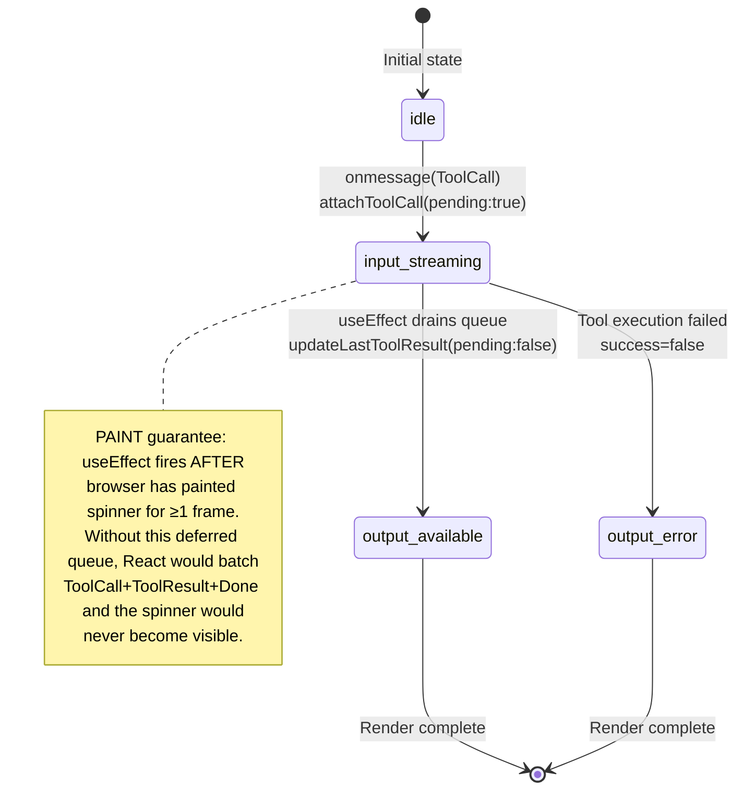

# Chat Stream & Tool Usage Flow

A Mermaid sequence diagram mirroring the flow documented in `docs/chat-flow.html`, with source references verified against the actual implementation.

## Legend

| Color | Event type |
|-------|-----------|
| 🔵 | Setup / IPC call |
| 🟢 | Streaming chunk |
| 🟠 | Tool call |
| 🔴 | Tool result |
| 🟣 | Browser paint |
| 🟡 | useEffect (post-paint) |
| ⚪ | Finalization |
| ⚫ | Synchronous batch (critical) |

---

## Main Sequence Diagram

```mermaid
sequenceDiagram
    autonumber
    participant U as User
    participant R as "React / useChat.ts"
    participant B as "Browser / DOM"
    participant IPC as "Tauri Channel"
    participant RS as "Rust / Tokio"
    participant OA as "Ollama API"

    %% ════════════════════════════════════════════════════════
    %% PHASE 1 — MESSAGE DISPATCH
    %% ════════════════════════════════════════════════════════
    U->>R: sendMessage()
    activate R
    R->>R: append user msg + assistant placeholder
    R->>R: setStreaming(true) · clear thinking
    R->>R: buildApiMessages()<br/>Ollama format: tool_calls + tool_name
    Note right of R: src/hooks/useChat.ts:23–75,203

    R->>IPC: invoke("generate_completion_stream", …)
    activate IPC
    IPC->>RS: generate_completion_stream
    activate RS
    RS->>RS: CancellationToken · register request_id
    RS->>RS: tokio::spawn(detached task)
    Note right of RS: src-tauri/src/commands/ai.rs:461–550
    RS-->>IPC: return request_id
    deactivate RS
    IPC-->>R: request_id
    deactivate IPC
    R->>R: activeRequestId.current = id
    deactivate R

    %% ════════════════════════════════════════════════════════
    %% PHASE 2 — AGENT LOOP SETUP
    %% ════════════════════════════════════════════════════════
    RS->>RS: run_agent_loop()
    activate RS
    RS->>RS: build_tools() → [write_file, read_file, bash]
    RS->>RS: stream_turn() — iteration 0
    Note right of RS: src-tauri/src/agent/agent_loop.rs:118–124
    RS->>OA: POST /api/chat<br/>stream: true · tools · think?

    %% ════════════════════════════════════════════════════════
    %% PHASE 3 — STREAMING CHUNKS
    %% ════════════════════════════════════════════════════════
    loop Per NDJSON chunk
        OA-->>RS: { message: { content, thinking }, done: false }
        RS->>IPC: send(Chunk { text, thinking })
        IPC->>R: onmessage(Chunk)
        activate R
        R->>R: rAF batch → setStreamingContent + setStreamingThinking
        Note right of R: src/hooks/useChat.ts:288–307
        R->>B: render &lt;Reasoning&gt; + content
        Note right of B: 🟣 PAINT — thinking / text visible
        deactivate R
    end

    %% ════════════════════════════════════════════════════════
    %% PHASE 4 — TOOL CALL DECISION
    %% ════════════════════════════════════════════════════════
    Note over B: isEmpty = isStreaming && content==="" && !streamingThinking<br/>If both empty → Loader variant="typing"
    Note right of B: src/components/chat/MessageList.tsx:135,175–176
    OA-->>RS: done=true · tool_calls=[write_file]
    RS->>RS: assistant_msg.tool_calls = tool_calls
    RS->>RS: push assistant_msg to history
    Note right of RS: agent_loop.rs:76–81

    %% ════════════════════════════════════════════════════════
    %% PHASE 5 — TOOL EXECUTION
    %% ════════════════════════════════════════════════════════
    RS->>IPC: send(ToolCall { tool, args })
    RS->>RS: execute_tool("write_file")
    Note right of RS: ⚠ Ignores model path; uses caller output_path<br/>src-tauri/src/agent/executor.rs:33–89
    RS->>RS: tokio::fs::write(project_dir, content)
    RS->>IPC: send(ToolResult { tool, success, output, path, content })
    Note right of RS: agent_loop.rs:170–189
    RS->>RS: wrote_file = true · break
    RS->>RS: history.push(tool result)
    RS->>IPC: send(Done)
    deactivate RS

    %% ════════════════════════════════════════════════════════
    %% PHASE 6 — SYNCHRONOUS BATCH (critical)
    %% ════════════════════════════════════════════════════════
    Note over IPC: ⚠ Tauri Channel while-loop<br/>core.js:99–105<br/>processes queued events<br/>synchronously in ONE JS task

    activate R
    IPC->>R: onmessage(ToolCall)
    R->>R: attachToolCall(pending: true)
    Note right of R: src/stores/chatStore.ts:71
    R->>R: Zustand schedules render

    IPC->>R: onmessage(ToolResult)
    R->>R: toolWritten = true · cancel rAF
    R->>R: onOutput(stripFences(content))
    R->>R: pendingToolResultsRef.push({...})
    R->>R: setToolResultTick(n+1)
    Note right of R: src/hooks/useChat.ts:310–321

    IPC->>R: onmessage(Done)
    R->>R: finalize()
    R->>R: flush queue · build finalMessage
    R->>R: setMessages · setStreaming(false)
    R->>R: writeFile(chat.json)
    Note right of R: src/hooks/useChat.ts:259–284,322–323
    deactivate R

    %% ════════════════════════════════════════════════════════
    %% PHASE 7 — REACT RENDER: SPINNER FRAME
    %% ════════════════════════════════════════════════════════
    R->>B: React flushes batched updates
    activate B
    R->>B: render Tool card · state="input-streaming"
    Note right of B: 🟣 PAINT — spinner visible<br/>Loader2 + "Processing" badge<br/>src/components/ui/tool.tsx:46–71
    deactivate B

    %% ════════════════════════════════════════════════════════
    %% PHASE 8 — POST-PAINT useEffect — MARK COMPLETE
    %% ════════════════════════════════════════════════════════
    R->>R: useEffect([toolResultTick]) fires
    Note right of R: 🟡 Post-paint guarantee<br/>react.dev/reference/react/useEffect<br/>Spinner guaranteed ≥1 frame before completion
    R->>R: drain queue → updateLastToolResult(pending: false)
    R->>R: patchLastToolCallPath(path)
    Note right of R: src/hooks/useChat.ts:190–201
    R->>B: render Tool card · state="output-available"
    Note right of B: 🟣 PAINT — completed state<br/>CheckCircle + "Completed" badge

    %% ════════════════════════════════════════════════════════
    %% MULTI-TURN CONTINUATION
    %% ════════════════════════════════════════════════════════
    Note over RS: If wrote_file == false:<br/>rebuild request(vec![]) · stream_turn() again<br/>MAX_ITERATIONS = 10
    Note right of RS: agent_loop.rs:140–212
```

---

## Tool Card State Machine



---

## Verified Implementation Details

### Tauri Channel Batching (`core.js:99–105`)

The `@tauri-apps/api/core.js` Channel class queues out-of-order messages and drains them synchronously:

```javascript
while (nextIndex in pendingMessages) {
    const message = pendingMessages[nextIndex];
    onmessage.call(this, message);
    delete pendingMessages[nextIndex];
    nextIndex++;
}
```

If Rust sends **ToolCall → ToolResult → Done** in rapid succession, all three `onmessage` handlers execute in a single uninterruptible JS task. No React render can paint between them. The `pendingToolResultsRef` + `useEffect` mechanism breaks this synchronous chain by deferring the visual store update until after the browser has painted.

**Source verification:** Line 99 of `node_modules/@tauri-apps/api/core.js` (transpiled output, matches Tauri v2 IPC source).

### Tokio `CancellationToken` + `tokio::select!`

Cancellation is cooperative. The `CancellationToken` is cloned: one copy stored in `AppState.cancellation_tokens` (HashMap), one moved into the spawned task. When the frontend calls `stop_generation_stream(request_id)`, the original token's `.cancel()` method is called, which resolves `.cancelled()` in the spawned task, causing `tokio::select!` to drop the HTTP stream and close the TCP connection.

**Per tokio-util docs:** [CancellationToken](https://docs.rs/tokio-util/latest/tokio_util/sync/struct.CancellationToken.html) supports clone + cancel for cooperative cancellation.

**Per Ollama API docs:** There is no `/api/abort` endpoint. Dropping the connection is the standard cancellation pattern.

### ollama-rs History Helper Limitation

`send_chat_messages_with_history_stream` accumulates text content and pushes `ChatMessage::assistant(content)` — it does **not** preserve `tool_calls` in the assistant history entry. Without the manual fix at `agent_loop.rs:76–81`, multi-turn tool conversations break because Ollama receives a `tool` role message with no prior `tool_calls` in the assistant message.

### Write-File Path Hard-Coding

`execute_write_file` intentionally ignores the model-provided filename and uses the caller's `output_path` parameter (`executor.rs:51`). This prevents path-traversal attacks (the model hallucinates paths like `"../../../etc/passwd"`). A `..` guard is also present. Parent directories are auto-created via `tokio::fs::create_dir_all`.

### Two Ollama Paths

`generate_ollama_completion_stream` branches at `ai.rs:209`:

- **`output_path` present** → agent loop path via `ollama-rs` (tool calling, manages its own history)
- **`output_path` null** → direct HTTP path (`reqwest` + raw JSON). Used when model capabilities don't include tools. The direct path builds JSON manually via `messages_to_ollama_json` to support the `tool_name` field, which ollama-rs `ChatMessage` lacks.

---

## File Index

| File | Role |
|------|------|
| `src/hooks/useChat.ts` | Main React hook: event handlers, deferred queue, finalize |
| `src/stores/chatStore.ts` | Zustand store: `attachToolCall`, `updateLastToolResult`, `patchLastToolCallPath` |
| `src/lib/ipc.ts` | `generateCompletionStream` wrapper, `CompletionEvent` type |
| `src-tauri/src/commands/ai.rs` | `CompletionEvent` enum, command registration, Ollama provider branching |
| `src-tauri/src/agent/agent_loop.rs` | `run_agent_loop`, `stream_turn`, manual history fix |
| `src-tauri/src/agent/executor.rs` | `execute_tool`, `execute_write_file`, `execute_read_file`, `execute_bash` |
| `src/types/chat.ts` | `ChatMessage`, `ToolCallRecord` types |
| `src/components/chat/MessageList.tsx` | Message rendering: reasoning blocks, tool cards, loader states |
| `src/components/ui/tool.tsx` | Generic tool UI: input-streaming, output-available, output-error states |
| `node_modules/@tauri-apps/api/core.js` | Tauri v2 Channel IPC: `transformCallback`, `pendingMessages` queue |
