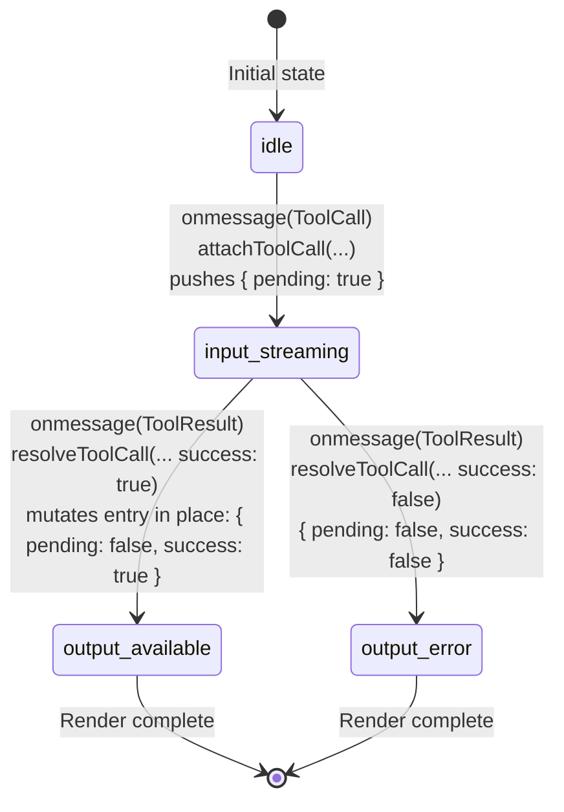

# Chat Stream & Tool Usage Flow

A Mermaid sequence diagram of one user-message → tool-call → response cycle, with every step verified against the current implementation. The example walks through a `write_file` call because it's the simplest single-tool case to follow — the agent actually has 15 tools available (see `src-tauri/src/agent/tools.rs`); the same Channel/streaming/direct-store-write mechanics apply regardless of which one the model picks.

## Legend

| Color | Event type |
|-------|-----------|
| 🔵 | Setup / IPC call |
| 🟢 | Streaming chunk |
| 🟠 | Tool call |
| 🔴 | Tool result |
| 🟣 | Browser paint |
| ⚪ | Finalization |

---

## Main Sequence Diagram

```mermaid
sequenceDiagram
    autonumber
    participant U as User
    participant R as "React / useChat.ts"
    participant B as "Browser / DOM"
    participant IPC as "Tauri Channel"
    participant RS as "Rust / Tokio"
    participant OA as "Ollama API"

    %% ════════════════════════════════════════════════════════
    %% PHASE 1 — MESSAGE DISPATCH
    %% ════════════════════════════════════════════════════════
    U->>R: sendMessage()
    activate R
    R->>R: append user msg + assistant placeholder
    R->>R: setStreaming(true) · clear thinking
    R->>R: buildApiMessages()<br/>Ollama format: tool_calls + tool_name
    Note right of R: src/hooks/useChat.ts:23–75,203

    R->>IPC: invoke("generate_completion_stream", …)
    activate IPC
    IPC->>RS: generate_completion_stream
    activate RS
    RS->>RS: CancellationToken · register request_id
    RS->>RS: tokio::spawn(detached task)
    Note right of RS: src-tauri/src/commands/ai.rs:461–550
    RS-->>IPC: return request_id
    deactivate RS
    IPC-->>R: request_id
    deactivate IPC
    R->>R: activeRequestId.current = id
    deactivate R

    %% ════════════════════════════════════════════════════════
    %% PHASE 2 — AGENT LOOP SETUP
    %% ════════════════════════════════════════════════════════
    RS->>RS: run_agent_loop()
    activate RS
    RS->>RS: build_tools() → 15 ToolInfo defs (tools.rs:160)
    RS->>RS: stream_turn() — iteration 0
    Note right of RS: src-tauri/src/agent/agent_loop.rs:118–124
    RS->>OA: POST /api/chat<br/>stream: true · tools · think?

    %% ════════════════════════════════════════════════════════
    %% PHASE 3 — STREAMING CHUNKS
    %% ════════════════════════════════════════════════════════
    loop Per NDJSON chunk
        OA-->>RS: { message: { content, thinking }, done: false }
        RS->>IPC: send(Chunk { text, thinking })
        IPC->>R: onmessage(Chunk)
        activate R
        R->>R: rAF batch → setStreamingContent + setStreamingThinking
        Note right of R: src/hooks/useChat.ts:288–307
        R->>B: render &lt;Reasoning&gt; + content
        Note right of B: 🟣 PAINT — thinking / text visible
        deactivate R
    end

    %% ════════════════════════════════════════════════════════
    %% PHASE 4 — TOOL CALL DECISION
    %% ════════════════════════════════════════════════════════
    Note over B: isEmpty = isStreaming && content==="" && !streamingThinking<br/>If both empty → Loader variant="typing"
    Note right of B: src/components/chat/MessageList.tsx:135,175–176
    OA-->>RS: done=true · tool_calls=[write_file]
    RS->>RS: assistant_msg.tool_calls = tool_calls
    RS->>RS: push assistant_msg to history
    Note right of RS: agent_loop.rs:47–55,169–172

    %% ════════════════════════════════════════════════════════
    %% PHASE 5 — TOOL EXECUTION
    %% ════════════════════════════════════════════════════════
    RS->>IPC: send(ToolCall { tool, args })
    RS->>RS: execute_tool("write_file")
    Note right of RS: Model-given path wins if present, sandboxed to project_dir<br/>(rejects "..", falls back to caller output_path)<br/>src-tauri/src/agent/executor.rs:99-145
    RS->>RS: tokio::fs::write(project_dir, content)
    RS->>IPC: send(ToolResult { tool, success, output, path, content })
    RS->>RS: wrote_file = true . break
    RS->>RS: history.push(tool result)
    RS->>IPC: send(Done)
    deactivate RS

    %% ════════════════════════════════════════════════════════
    %% PHASE 6 — STORE WRITES
    %% ════════════════════════════════════════════════════════
    Note over IPC: Tauri Channel while-loop (core.js:99-105) drains<br/>ToolCall to ToolResult to Done synchronously in ONE JS task.<br/>attachToolCall/resolveToolCall write straight to Zustand as each event arrives.

    activate R
    IPC->>R: onmessage(ToolCall)
    R->>R: attachToolCall(entityId, tool, "", args)<br/>pushes { tool, arguments, pending: true } onto toolCalls[]
    Note right of R: src/stores/chatStore.ts:77-86<br/>src/hooks/chat/streamHandler.ts:94-96

    IPC->>R: onmessage(ToolResult)
    R->>R: resolveToolCall(entityId, tool, output, success, path)<br/>finds first pending entry matching tool, sets<br/>{ result, success, pending: false, path }
    Note right of R: Front-to-back search assumes ToolCall/ToolResult<br/>arrive in matching index order (chatStore.ts:88-105)
    R->>R: if write_file/edit_file succeeded:<br/>onCodeOutput(content) . onToolWrite(path, content)
    Note right of R: src/hooks/chat/streamHandler.ts:141-159

    IPC->>R: onmessage(Done)
    R->>R: finalize(content, thinking)<br/>setMessages . setStreaming(false) . writeFile(chat.json)
    Note right of R: src/hooks/chat/streamHandler.ts:53-71,160-172
    deactivate R

    %% ════════════════════════════════════════════════════════
    %% PHASE 7 — RENDER
    %% ════════════════════════════════════════════════════════
    R->>B: Zustand notifies subscribers, React re-renders
    activate B
    R->>B: render Tool card . state derives from { pending, success }
    Note right of B: PAINT - pending: true gives "input-streaming" (spinner)<br/>pending: false, success: true gives "output-available"<br/>pending: false, success: false gives "output-error"<br/>src/components/ui/tool.tsx:15-27,171-187
    deactivate B

    %% ════════════════════════════════════════════════════════
    %% MULTI-TURN CONTINUATION
    %% ════════════════════════════════════════════════════════
    Note over RS: If wrote_file == false:<br/>rebuild request(vec![]) . stream_turn() again<br/>MAX_ITERATIONS = 20 (agent_loop.rs:17)
```

---

## Tool Card State Machine



`tool.tsx` derives the rendered state directly from `{ pending, success }` on each `toolCalls[]` entry — there's no separate UI-state field to keep in sync (`tool.tsx:15–27,171–187`).

---

## Verified Implementation Details

### Tauri Channel Batching

The `@tauri-apps/api/core.js` Channel class queues out-of-order messages and drains them synchronously (`core.js:99–105`, transpiled output — matches the Tauri v2 IPC source):

```javascript
while (nextIndex in pendingMessages) {
    const message = pendingMessages[nextIndex];
    onmessage.call(this, message);
    delete pendingMessages[nextIndex];
    nextIndex++;
}
```

If Rust sends **ToolCall → ToolResult → Done** in rapid succession, all three `onmessage` handlers can run in one uninterruptible JS task. `attachToolCall` and `resolveToolCall` write straight to the Zustand store as each event arrives (`streamHandler.ts:94–96,144`), and `tool.tsx` derives the rendered card state directly from `{ pending, success }` — see [Tool Card State Machine](#tool-card-state-machine) above.

### Tokio `CancellationToken` + `tokio::select!`

Cancellation is cooperative. The `CancellationToken` is cloned: one copy stored in `AppState.cancellation_tokens` (HashMap), one moved into the spawned task. When the frontend calls `stop_generation_stream(request_id)`, the original token's `.cancel()` method is called, which resolves `.cancelled()` in the spawned task, causing `tokio::select!` to drop the HTTP stream and close the TCP connection.

**Per tokio-util docs:** [CancellationToken](https://docs.rs/tokio-util/latest/tokio_util/sync/struct.CancellationToken.html) supports clone + cancel for cooperative cancellation.

**Per Ollama API docs:** There is no `/api/abort` endpoint. Dropping the connection is the standard cancellation pattern.

### ollama-rs History Helper Limitation

`send_chat_messages_with_history_stream` accumulates text content and pushes `ChatMessage::assistant(content)` — it does **not** preserve `tool_calls` in the assistant history entry. Without the manual fix at `agent_loop.rs:47–55,169–172`, multi-turn tool conversations break because Ollama receives a `tool` role message with no prior `tool_calls` in the assistant message.

### Write-File Path Resolution

`execute_write_file` (`executor.rs:99–145`) prefers the model-given path when the model supplies one: it's resolved against `project_dir`, rejected if it contains a `..` segment or resolves outside `project_dir`, and falls back to the caller's `output_path` parameter only when the model didn't provide a usable path. This sandboxes against path-traversal (the model hallucinating something like `"../../../etc/passwd"`) while still letting the model name and place the file it's writing. Parent directories are auto-created via `tokio::fs::create_dir_all`.

### Two Ollama Paths

`generate_ollama_completion_stream` (`ai.rs:229`) branches on `output_path` at line 237:

- **`output_path` present** → agent loop path via `ollama-rs` (tool calling, manages its own history)
- **`output_path` null** → direct HTTP path (`reqwest` + raw JSON). Used when model capabilities don't include tools. The direct path builds JSON manually via `messages_to_ollama_json` to support the `tool_name` field, which ollama-rs `ChatMessage` lacks.

---

## File Index

| File | Role |
|------|------|
| `src/hooks/useChat.ts` | Main React hook: sends messages, owns streaming state |
| `src/hooks/chat/streamHandler.ts` | `createStreamHandler`: Channel `onmessage` handlers, `finalize` |
| `src/stores/chatStore.ts` | Zustand store: `attachToolCall`, `resolveToolCall` |
| `src/lib/ipc.ts` | `generateCompletionStream` wrapper, `CompletionEvent` type |
| `src-tauri/src/commands/ai.rs` | `CompletionEvent` enum, command registration, Ollama provider branching |
| `src-tauri/src/agent/agent_loop.rs` | `run_agent_loop`, `stream_turn`, manual history fix |
| `src-tauri/src/agent/executor.rs` | `execute_tool`, `execute_write_file`, `execute_read_file`, `execute_bash` |
| `src/types/chat.ts` | `ChatMessage`, `ToolCallRecord` types |
| `src/components/chat/MessageList.tsx` | Message rendering: reasoning blocks, tool cards, loader states |
| `src/components/ui/tool.tsx` | Generic tool UI: input-streaming, output-available, output-error states |
| `node_modules/@tauri-apps/api/core.js` | Tauri v2 Channel IPC: `transformCallback`, `pendingMessages` queue |
