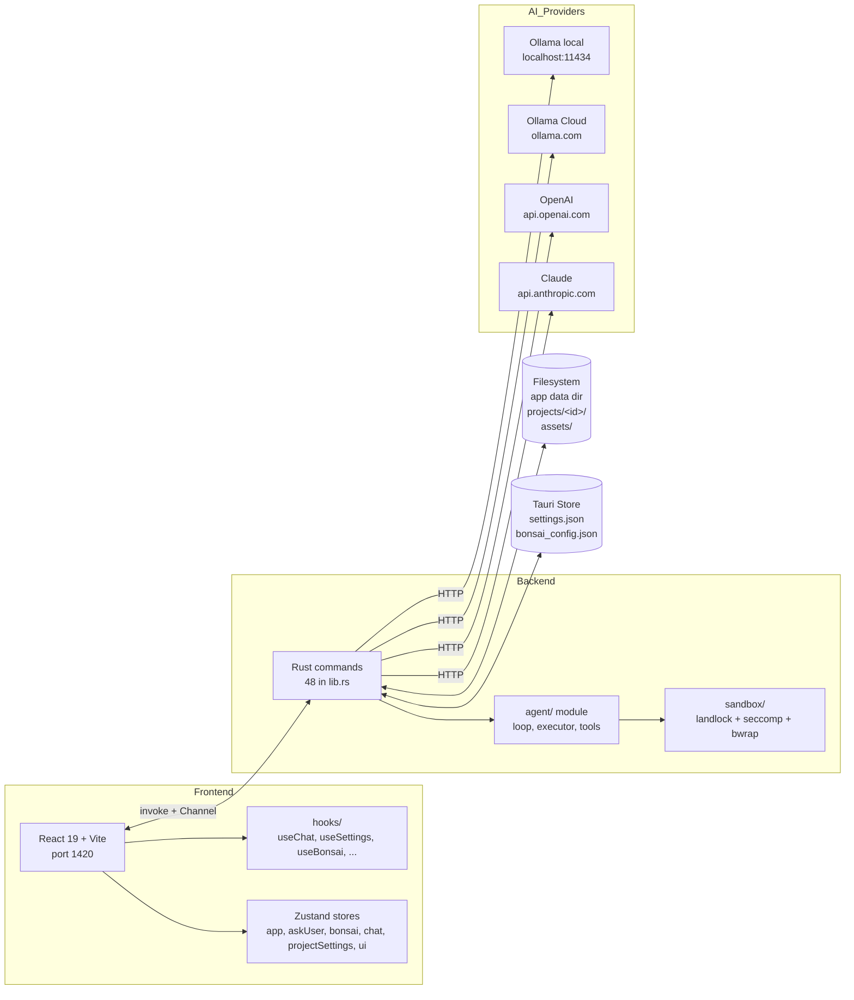

# Architecture Overview

Two processes, one IPC channel, four AI providers, and one stateful per-project file tree. The shape of the system at a glance.

## System diagram

The frontend never talks to AI providers directly — every request flows through a Rust command. The Rust side owns the streaming channel, tool permission resolution, and `ask_user` / `ask_user_form` round-trips.

## Sections

- **[Frontend]({{ '/architecture/frontend/' | relative_url }})** — React 19 + Vite, panel structure, hooks, state
- **[Backend]({{ '/architecture/backend/' | relative_url }})** — all 48 Rust commands by group
- **[IPC]({{ '/architecture/ipc/' | relative_url }})** — Tauri `invoke` and `Channel` patterns
- **[Data Persistence]({{ '/architecture/data-persistence/' | relative_url }})** — settings, projects, assets, workflows
- **[AI Streaming]({{ '/architecture/ai-streaming/' | relative_url }})** — the 8-variant `CompletionEvent` enum

## Existing deep-dive reports

- **[Chat Stream & Tool Flow]({{ '/architecture/chat-flow/' | relative_url }})** — Mermaid sequence diagram with source references

Pre-implementation proposals and feasibility analyses live in [Plans & Specs]({{ '/plans/' | relative_url }}) — see [Tool Permission System]({{ '/plans/tool-permission-architecture/' | relative_url }}) and [Open Agent SDK Analysis]({{ '/plans/open-agent-sdk-analysis/' | relative_url }}).
